# Model Outputs: Visual Flow

> **Render this file:** press `Shift+Cmd+V` (Mac) or `Shift+Ctrl+V` (Windows/Linux) in VS Code to open the Markdown preview. On GitHub it renders automatically.
>
> Images are stored in `model_output_showcase/` so they display correctly in both local preview and on GitHub. Run the notebook top to bottom to regenerate them into `output/`.

---

## 01 — Class Distribution

What it shows: count and percentage split of borrowers who repaid versus those who defaulted across the full 9,578-loan dataset.

What to look for: the default rate sits at 16%. Mild but real imbalance — a naïve classifier that always predicts "repaid" scores 84% accuracy while catching zero defaulters. This gap motivates every imbalance-handling choice in the pipeline.

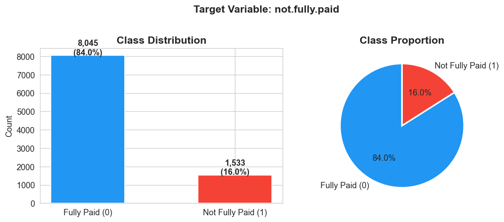

---

## 02 — Univariate Numeric Distributions

What it shows: histogram and KDE for every numeric feature in the dataset, with median (red dashed) and mean (orange dotted) marked.

What to look for: `revol.bal`, `inq.last.6mths`, and `days.with.cr.line` are heavily right-skewed — the long tails are what motivate IQR capping in preprocessing. `fico` is roughly bimodal, separating lower-quality from standard borrowers. `int.rate` clusters between 10–14%, with a tail of high-risk rates above 18%.

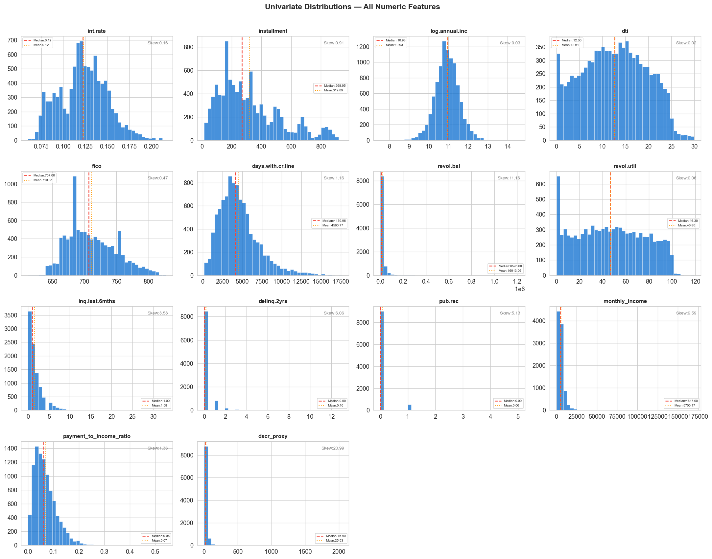

---

## 03 — Categorical Analysis

What it shows: three panels — loan purpose counts, default rate by purpose (benchmarked against the overall 16% rate), and OCC FICO tier distribution with default rate per tier.

What to look for: `small_business` and `all_other` carry default rates well above the baseline. The OCC tier chart should show a clear gradient: Substandard borrowers default at roughly 3× the rate of Pass borrowers. This validates the FICO tier engineering.

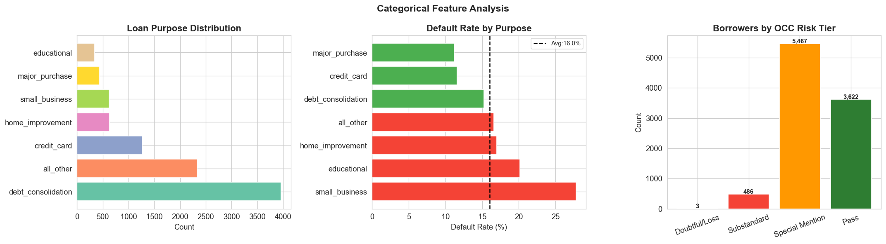

---

## 04 — Correlation Heatmap

What it shows: Pearson correlation matrix across all numeric features including engineered ones.

What to look for: `int.rate` has the strongest positive correlation with the default target. `fico` is the strongest negative. `payment_to_income_ratio` and `dscr_proxy` are highly collinear by construction — both are transformations of the same income and installment values. `log.annual.inc` and `monthly_income` are near-perfectly collinear (one is dropped in preprocessing).

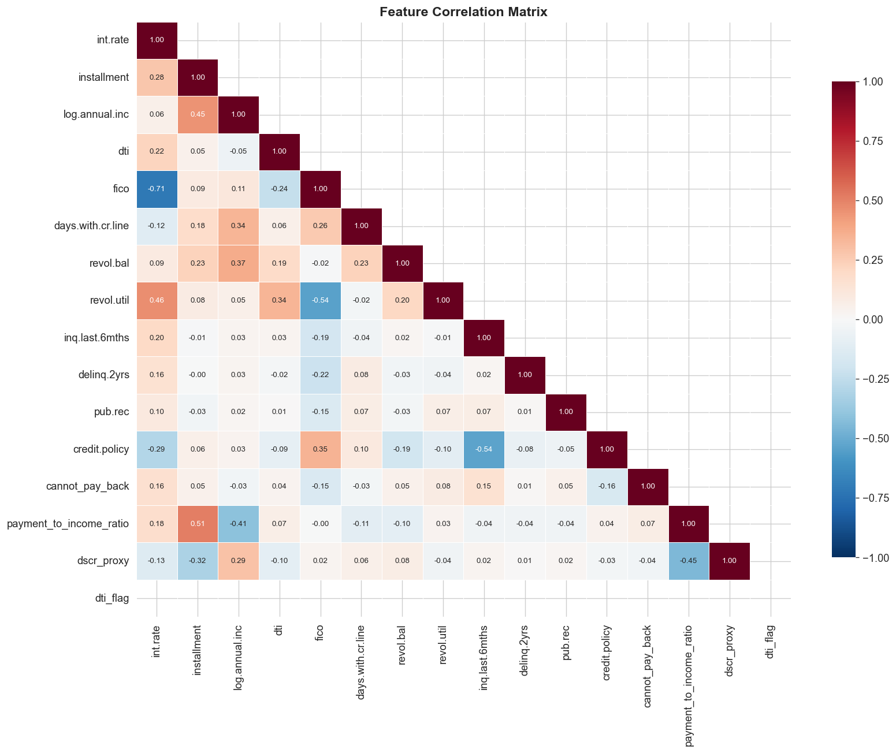

---

## 05 — Feature Distributions by Target Class

What it shows: box plots for nine key features split by `cannot_pay_back`. Gold diamonds mark the group mean.

What to look for: defaulters have lower FICO scores, higher interest rates, and lower income — the expected directional signals. The DSCR proxy and payment-to-income ratio should show the most separation, since they directly encode repayment capacity. Small separation on a feature suggests it adds little discriminative power on its own.

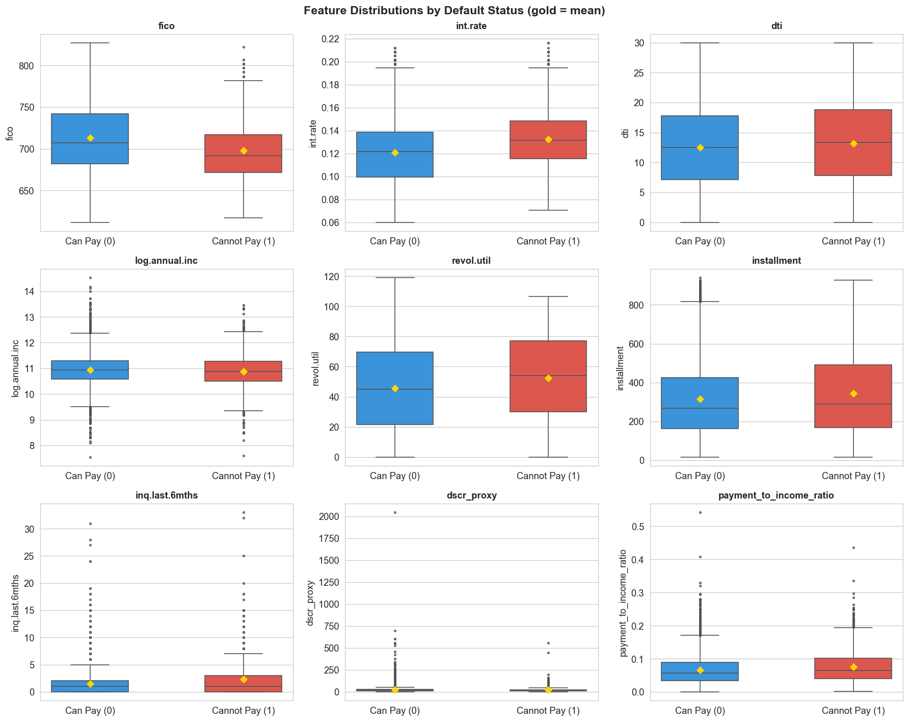

---

## 06 — Capacity Feature Violin Plots

What it shows: violin plots for DSCR proxy, payment-to-income ratio, DTI, and log annual income, split by target class.

What to look for: the violin widths show where each class concentrates. Defaulters should cluster at lower DSCR values (below 1.0 means income can't cover the payment) and higher payment-to-income ratios. If the violins are nearly identical for a feature, it is not useful for discrimination.

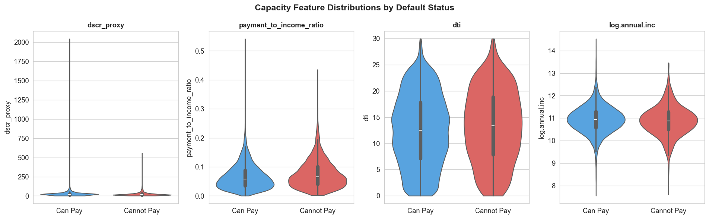

---

## 07 — Default Rate by Loan Purpose

What it shows: stacked bar chart showing the split of defaulted vs repaid borrowers within each loan purpose category, sorted by default rate.

What to look for: `small_business` loans carry the highest default rate and likely warrant different underwriting criteria. `credit_card` and `debt_consolidation` — the two largest purpose categories by volume — cluster around the overall average, which means the purpose feature adds signal primarily at the extremes.

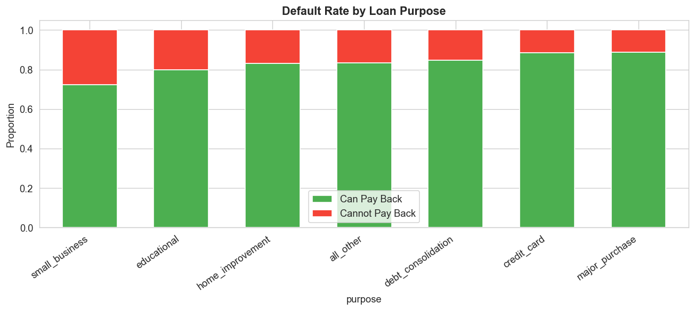

---

## 08 — Pair Plot: Top 5 Discriminating Features

What it shows: pairwise scatter plots and diagonal KDEs for FICO, interest rate, DTI, `inq.last.6mths`, and `log.annual.inc`, coloured by default outcome (sampled for speed).

What to look for: the FICO × int.rate scatter should show the clearest separation — defaulters cluster in the low-FICO, high-rate quadrant. Overlapping clouds on any pair indicate features where the two classes are hard to distinguish with a linear boundary.

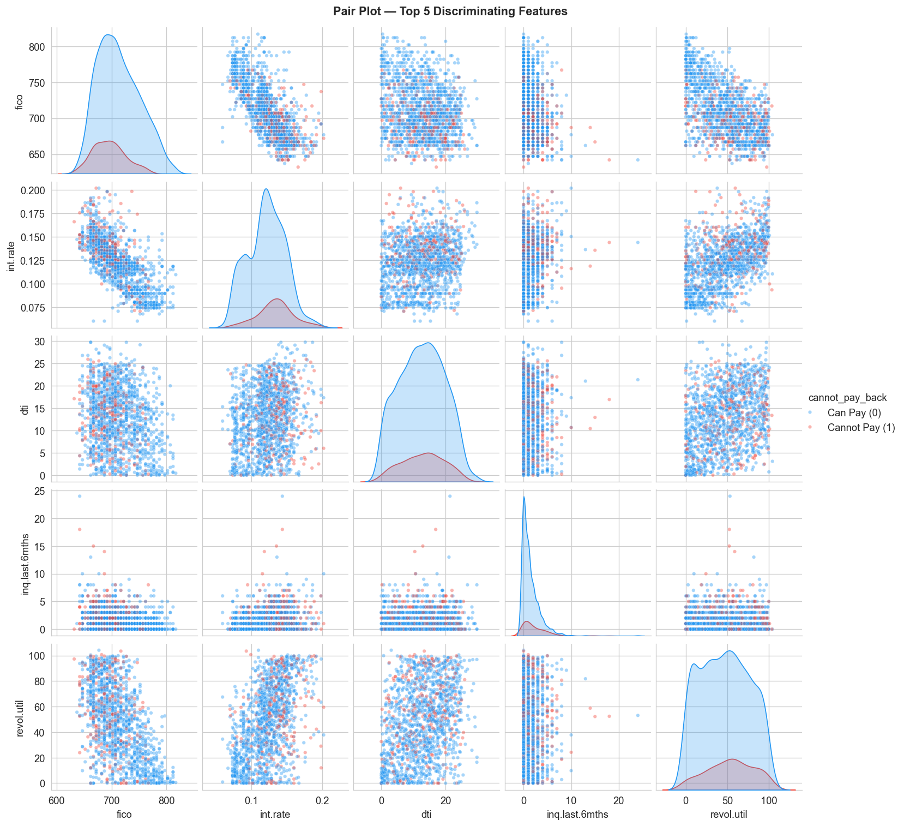

---

## 09 — LOF Outlier Detection

What it shows: PCA 2D projection of the feature space with LOF-flagged outliers highlighted. Local Outlier Factor scores are shown for flagged and normal observations.

What to look for: outliers should appear at the periphery of the distribution in PCA space, not embedded in the centre. If outliers cluster in a specific region, they may represent a coherent borrower subgroup rather than noise. All flagged observations are retained — their flags are dropped in preprocessing after confirming they add no incremental predictive signal.

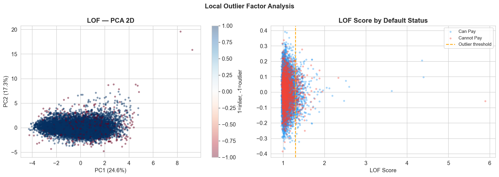

---

## 10 — Mahalanobis Distance

What it shows: distribution of squared Mahalanobis distances across all borrowers, with the chi² 99.9th percentile threshold marked. Box plots compare the distance distributions for flagged and normal observations.

What to look for: the distance distribution should be approximately chi² shaped. Flagged observations should sit well past the threshold — a large cluster near the boundary suggests the threshold may be too tight. As with LOF, all flagged observations are retained.

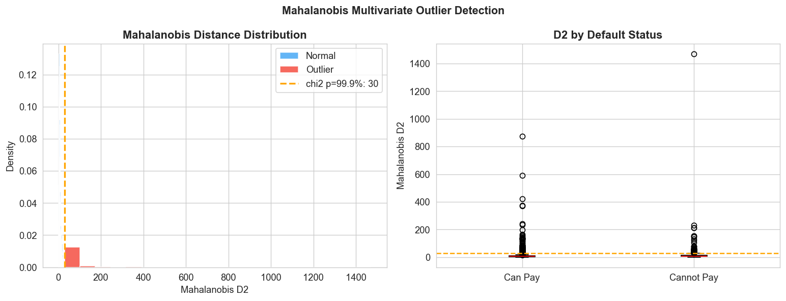

---

## 11 — Cluster Selection (Elbow + Silhouette)

What it shows: inertia curve (elbow method) and silhouette score for k = 2 through 8.

What to look for: the optimal k is the silhouette peak. The elbow and silhouette should broadly agree. A silhouette score above 0.15 indicates meaningful cluster separation on this dataset; the chosen k here is 3.

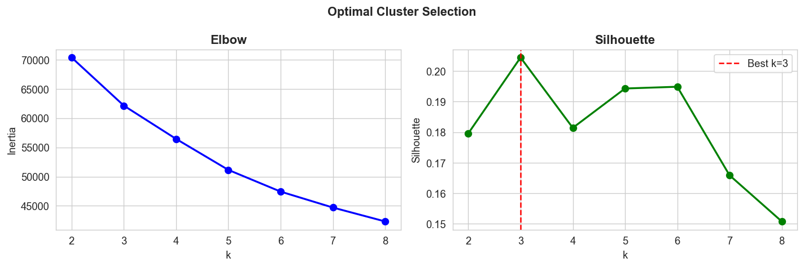

---

## 12 — K-Means Clusters in PCA Space

What it shows: two PCA 2D projections side by side — one coloured by cluster assignment, one coloured by default outcome.

What to look for: cluster boundaries should roughly align with regions of higher default concentration. A cluster with a markedly higher default rate than the others confirms that K-Means is capturing real risk stratification, not noise. The cluster label is carried into the model as a feature.

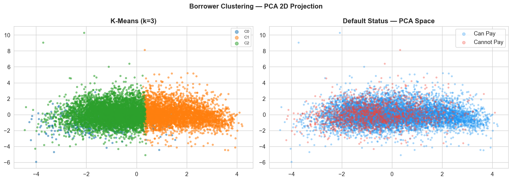

---

## 13 — Cluster Risk Profiles

What it shows: bar chart of default rate per cluster alongside a table of mean feature values per cluster.

What to look for: the cluster with the highest default rate should have the lowest FICO, highest int.rate, and lowest income — matching the individual-feature signals observed in Section 3.2. Clusters that are almost identical in profile suggest k is too high; a single cluster dominating size suggests k is too low.

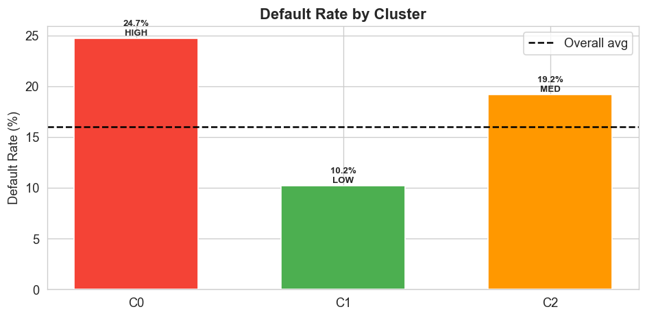

---

## 14 — SMOTE-ENN Resampling

What it shows: class distribution before and after SMOTE-ENN is applied to the Logistic Regression training set.

What to look for: after resampling, the minority (default) class should be substantially larger. SMOTE-ENN does not produce a perfect 50/50 split — ENN's borderline cleaning removes some synthetic and real samples — so some imbalance typically remains. The test set is not shown here because it is never resampled.

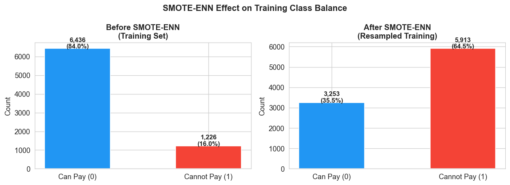

---

## 15 — Logistic Regression Evaluation

What it shows: four-panel evaluation dashboard — confusion matrix, ROC curve, Precision-Recall curve, and Precision-Recall Gain (PRG) curve.

What to look for: the confusion matrix false negative count (bottom left cell) is the primary concern — these are defaulters the model missed. The PRG curve penalises performance near the random baseline more heavily than the standard PR curve; AUPRG above 0.50 on this dataset indicates the model is meaningfully better than chance on the hard problem of catching defaulters.

Expected: ROC-AUC ≈ 0.68, AUPRG ≈ 0.57

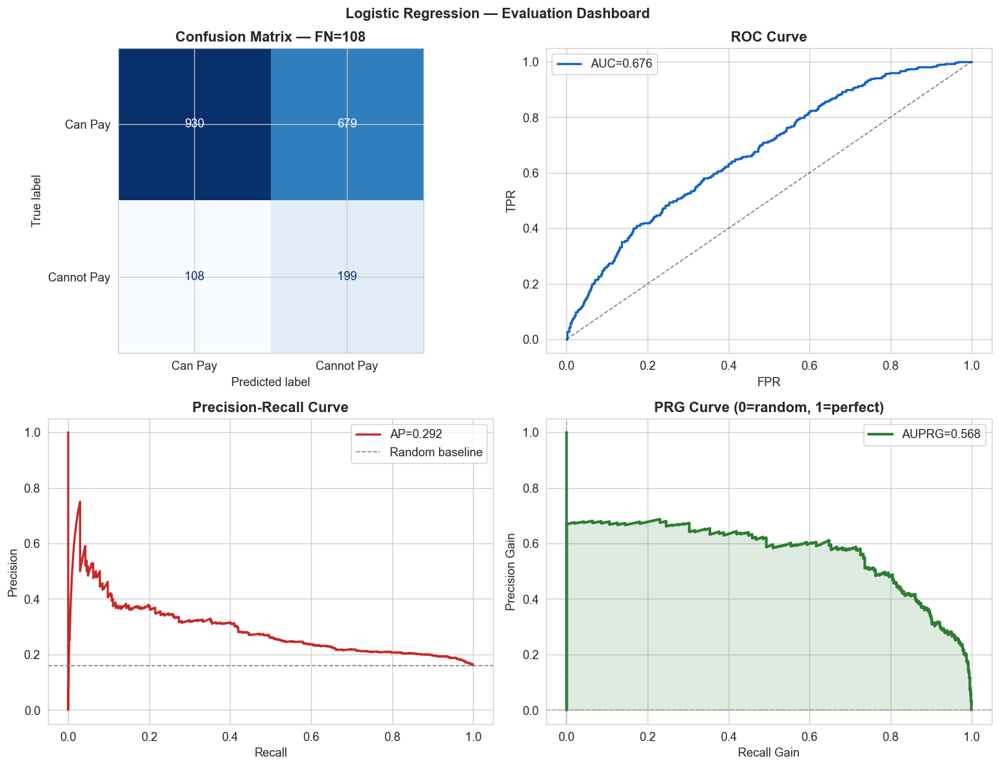

---

## 16 — Logistic Regression Coefficients

What it shows: top 20 feature coefficients on the log-odds scale, coloured red (positive — increases default probability) or green (negative — reduces it).

What to look for: `int.rate` should have the largest positive coefficient — the lender's own risk pricing is the strongest signal. `fico` and `credit.policy` should be the strongest negative coefficients. This chart is the basis for any adverse action notice: rejected borrowers can be explained by reading off the top positive contributors for their application.

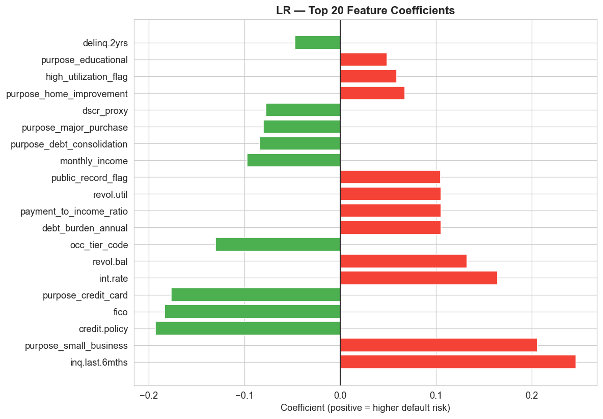

---

## 17 — Random Forest Evaluation

What it shows: same four-panel layout as LR — confusion matrix, ROC, PR, and PRG curves.

What to look for: RF's ROC-AUC and AUPRG should be broadly comparable to LR, not dramatically higher. A large gap (>0.05 ROC-AUC) between LR and RF on this dataset is a signal of overfitting to training structure rather than genuine superior discriminability.

Expected: ROC-AUC ≈ 0.66, AUPRG ≈ 0.52

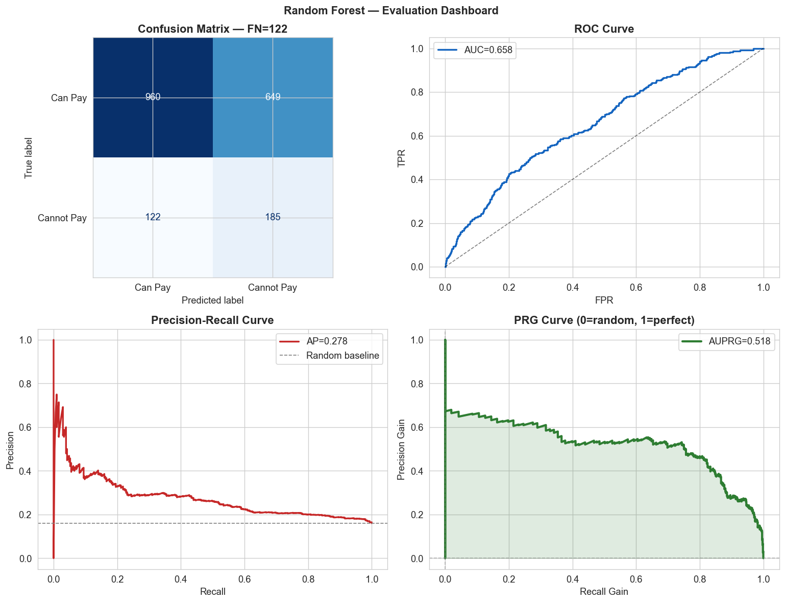

---

## 18 — Random Forest Feature Importances

What it shows: Gini-based feature importances for all features, ranked descending.

What to look for: `int.rate` and `fico` typically dominate. The cluster label importance indicates how much of the model's signal comes from the multivariate borrower segment captured in EDA. A cluster importance near zero would suggest the clustering step adds no predictive value.

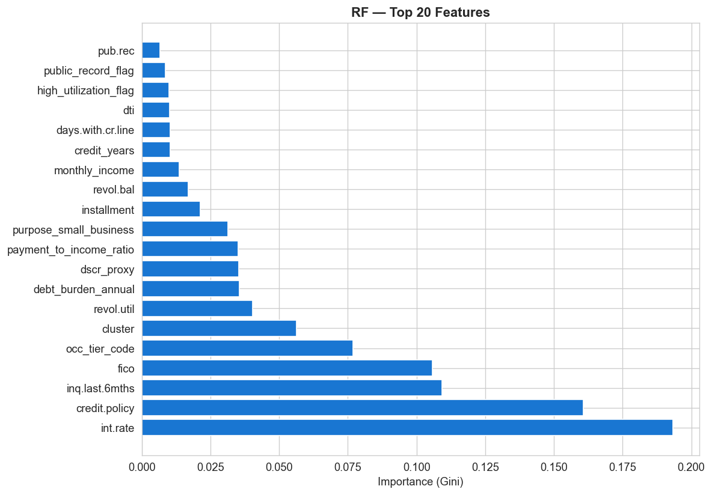

---

## 19 — XGBoost Evaluation

What it shows: confusion matrix, ROC, PR, and PRG curves for XGBoost.

What to look for: XGBoost tends to produce a slightly higher ROC-AUC than LR due to its capacity to capture non-linear interactions, but the gap on this dataset is small — the signal is largely linear. The operating threshold for XGBoost (found from the PR curve at recall ≥ 0.88) should be in a realistic range; a threshold below 0.10 indicates the model's probability estimates are poorly calibrated.

Expected: ROC-AUC ≈ 0.67, AUPRG ≈ 0.52

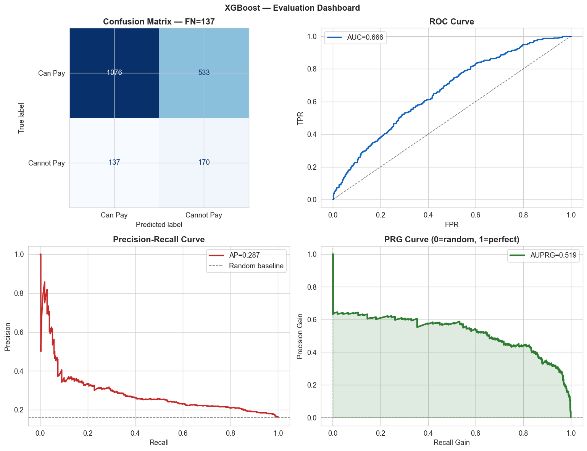

---

## 20 — XGBoost Feature Importances

What it shows: gain-based feature importances for XGBoost. Gain measures the improvement in the loss function from each feature's splits, weighted by the number of samples affected.

What to look for: gain importances are less susceptible to high-cardinality bias than count-based importances. The top features should broadly match the LR coefficient ranking — if the ordering differs substantially, XGBoost is capturing a different structure than the linear model.

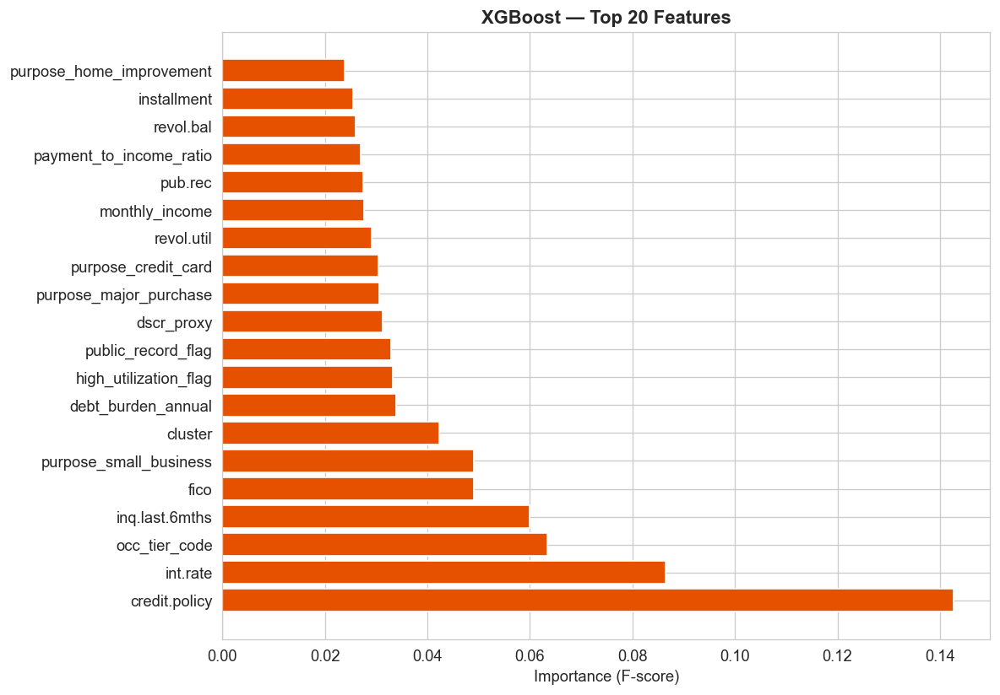

---

## 21 — LightGBM Evaluation

What it shows: confusion matrix, ROC, PR, and PRG curves for LightGBM.

What to look for: LightGBM's train/test ROC-AUC gap should be monitored — a gap above 0.10 indicates overfitting. Its operating threshold should be in a similar range to LR and XGBoost; a threshold near zero is a sign the model is producing poorly separated probability scores.

Expected: ROC-AUC ≈ 0.66, AUPRG ≈ 0.51

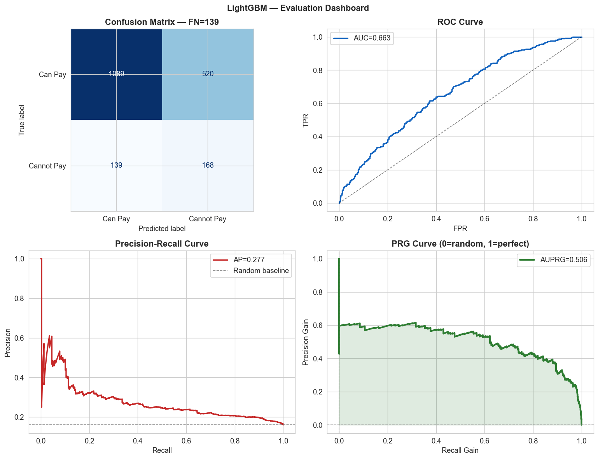

---

## 22 — LightGBM Feature Importances

What it shows: gain-based feature importances for LightGBM.

What to look for: the ranking should be consistent with XGBoost and LR. Large divergences in which features rank highly suggest LightGBM is fitting a different projection of the data — which may indicate overfitting, especially if those features have low importance in both LR and RF.

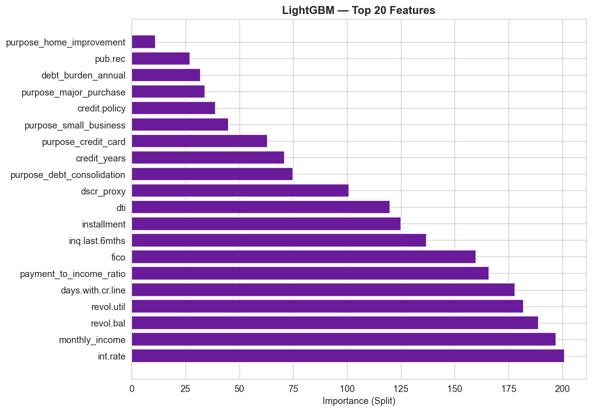

---

## 23 — Vintage Analysis: OCC FICO Tier Cohorts

What it shows: recall and AUPRG for each of the four models, broken out by OCC FICO risk tier (Substandard, Special Mention, Pass) on the held-out test set.

What to look for: recall should remain high across all tiers. A model that achieves 88% aggregate recall but drops to 20–30% recall on the Pass cohort is not generalising — it is exploiting the concentration of defaulters in the Substandard tier. The selected model should show the most consistent recall across cohorts, not just the highest aggregate. The Doubtful/Loss tier (FICO < 620) is excluded — only 3 borrowers in the full dataset, too few for a meaningful cohort.

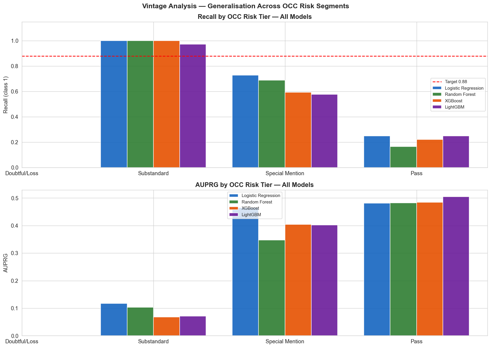

---

## 24 — Model Selection

What it shows: three-panel comparison across all four models — PRG curves, ROC curves, and recall bars at each model's operating threshold.

What to look for: the recall bars should show which models meet the 0.88 business target. Models that only reach 0.88 by using an extremely low threshold (< 0.10) are not practically usable — they reject the vast majority of applicants. The PRG and ROC curves show overall discriminability independent of threshold choice.

Selected: Logistic Regression — T = 0.3588, recall = 0.8827, ROC-AUC = 0.6758, AUPRG = 0.5677

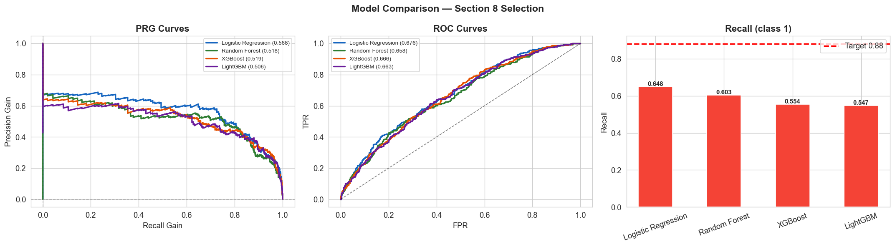

---

## 25 — Repayment Likelihood Formula

What it shows: three panels — P(cannot pay back) score distribution for repaid vs defaulted borrowers, OCC tier distribution on the test set using probability-based tier assignment, and a threshold sweep showing how recall and precision trade off across all possible operating thresholds.

What to look for: the score distributions for the two classes should show meaningful separation, even if they overlap — perfect separation is not expected at this ROC-AUC level. The threshold sweep validates T = 0.3588 as the highest threshold where recall meets the 0.88 target. The OCC tier distribution shows the proportion of borrowers falling into each risk category under the selected model's probability outputs.

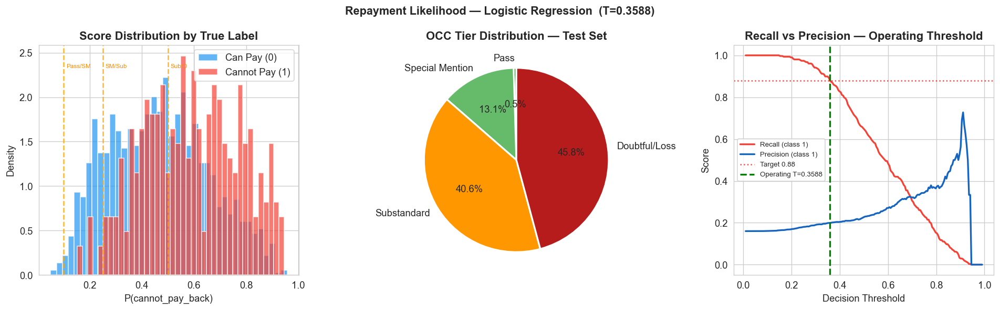

---

## Full Pipeline at a Glance

```
RAW DATA (9,578 loans, 14 features)
        |
        | Feature Engineering
        |   CFPB ATR capacity features (DSCR, payment-to-income)
        |   Regulatory flags (DTI > 43%, util > 80%, delinquency, pub.rec)
        |   OCC FICO tier mapping (Doubtful/Loss / Substandard / Special Mention / Pass)
        v
        | EDA
        |   Univariate → Multivariate → LOF → Mahalanobis → K-Means (k=3)
        v
        | Preprocessing
        |   One-hot encode purpose (drop_first)
        |   Drop: occ_tier, log.annual.inc, lof_flag, mahal_flag
        |   IQR cap: installment, days.with.cr.line, revol.bal,
        |            inq.last.6mths, monthly_income
        v
        | Train/test split (80/20 stratified)
        | StandardScaler — fit on train, transform both
        v
        +---> SMOTE-ENN (training set only)
        |           |
        |           v
        |     Logistic Regression    class_weight='balanced'
        |     Optuna · 50 trials · 5-fold CV recall · resampled train
        |
        +---> Random Forest          class_weight='balanced_subsample'
        |     XGBoost                scale_pos_weight = neg/pos (5.25)
        |     LightGBM               is_unbalance=True
        |     Optuna · 50 trials · 5-fold CV recall · original train
        v
        | Vintage Analysis
        |   Recall + AUPRG per OCC FICO tier cohort · all 4 models · test set
        v
        | Model Selection
        |   Highest T where recall(class 1) >= 0.88 on test set (PR curve)
        |   Ranked: recall @ T → min tier recall → AUPRG
        v
SELECTED: Logistic Regression
    T = 0.3588  ·  recall = 0.8827  ·  36 missed defaulters of 307
        |
        v
P(cannot_pay_back) + P(can_pay_back) = 1.0  per borrower
OCC tier assigned from raw probability output
```
