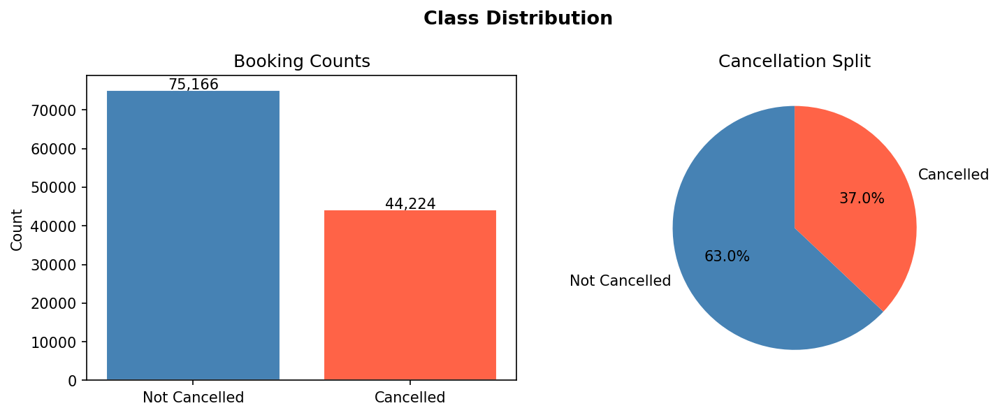
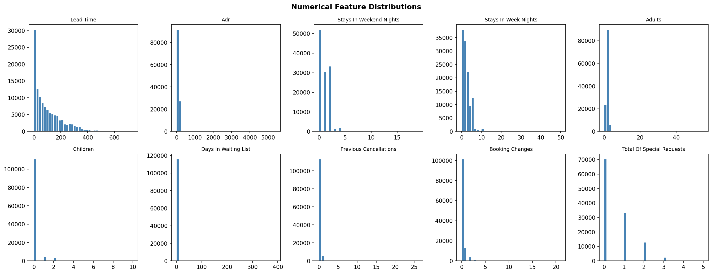
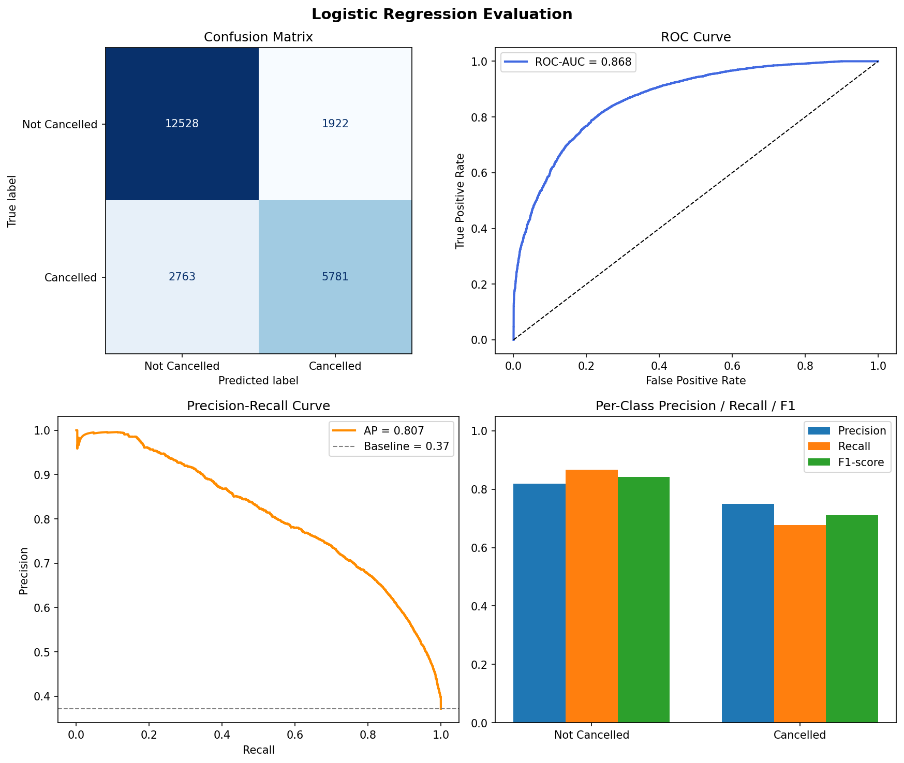
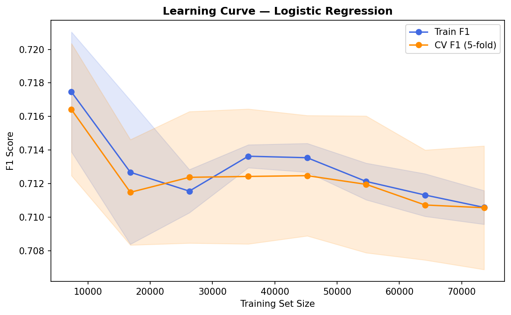
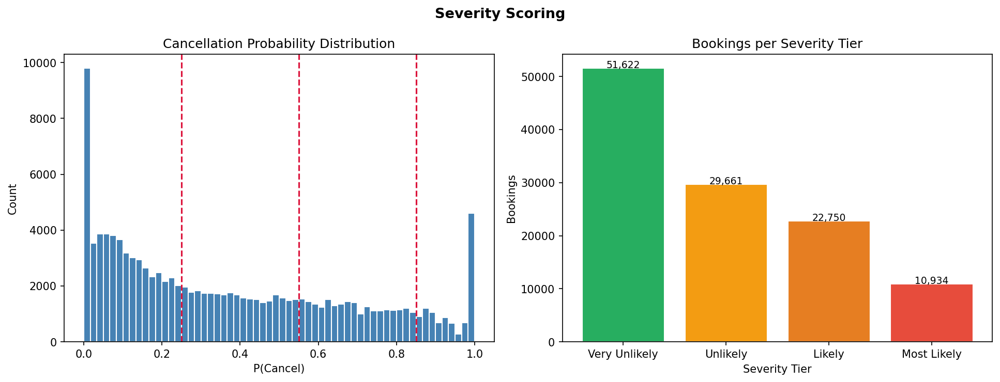
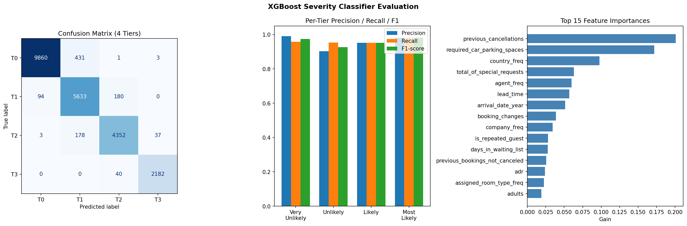
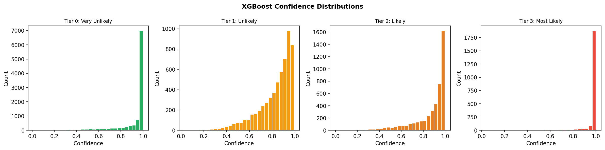
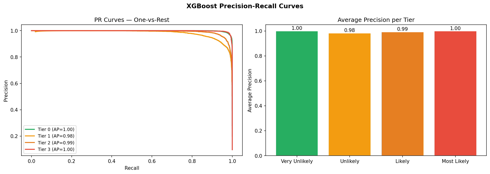
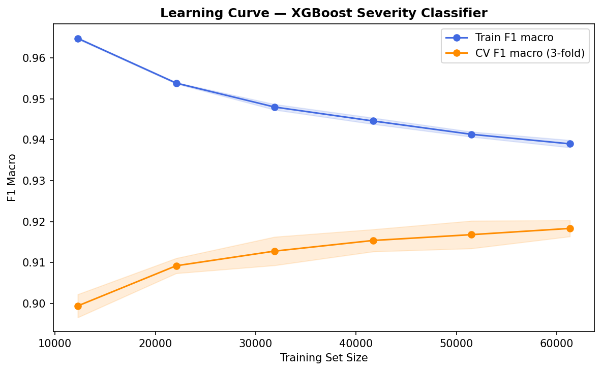

# Model Outputs: Visual Flow

> **Render this file:** press `Shift+Cmd+V` (Mac) or `Shift+Ctrl+V` (Windows/Linux) in VS Code to open the Markdown preview. On GitHub it renders automatically.
>
> Images are stored in `model_output_showcase/` so they display correctly in both local preview and on GitHub. Run `python main.py` to regenerate them at any time into `output/`.

---

## Output Images (main.py)

Run `python main.py` to generate fresh images in `output/`. The images below in `model_output_showcase/` are the reference outputs from a full pipeline run.

---

## 01 — Class Distribution

What it shows: count and percentage split of cancelled vs not cancelled bookings across the full 119k dataset.

What to look for: the cancellation rate sits around 37%. High enough to be a real business problem but not so extreme that the dataset needs heavy rebalancing.



---

## 02 — Numerical Feature Distributions

What it shows: histograms for the 10 key numerical features.

What to look for: heavy right skew on `lead_time`, `days_in_waiting_list`, and `previous_cancellations`. Most bookings cluster near zero on those axes with long tails. This is what motivates the outlier capping step.



---

## 03 — Logistic Regression Evaluation

What it shows: four-panel evaluation dashboard for the binary cancel/no-cancel classifier.

- **Top left (Confusion Matrix):** counts of true positives, false positives, true negatives, false negatives. False negatives (missed cancellations) are the costly error.
- **Top right (ROC Curve):** true positive rate vs false positive rate at every threshold. Expected ROC-AUC: 0.85+.
- **Bottom left (Precision-Recall Curve):** more informative than ROC on imbalanced data. The no-skill baseline is a flat line at ~0.37 (positive class prevalence).
- **Bottom right (Per-Class Metrics):** precision, recall, and F1 side by side. Recall on the cancelled class should be prioritised — missing a cancellation costs more than a false alarm.



---

## 04 — Logistic Regression Learning Curve

What it shows: training F1 and 5-fold cross-validation F1 plotted against training set size. Shaded bands show standard deviation across folds.

What to look for: both curves converge as training size increases with a narrow gap at full data. A large persistent gap signals overfitting. Both curves flat and low signals underfitting.

Expected:
- Train F1 (full data): ~0.81
- Val F1 (5-fold CV): ~0.79
- Gap: ~0.02 — no significant overfitting



---

## 05 — Severity Scoring

What it shows: how P(cancel) from the LR model maps to the four severity tiers.

- **Left (Probability Distribution):** full-dataset P(cancel) histogram with tier boundary lines at 0.25, 0.55, and 0.85.
- **Right (Bookings per Tier):** bar chart of how many bookings fall into each tier. Tier 0 contains the majority; Tier 3 is a small but high-priority cohort.

What to look for: the tier boundaries should cut through natural gaps in the distribution. Tier 0 and Tier 3 should be clearly distinct clusters, not blended.



---

## 06 — XGBoost Severity Classifier Evaluation

What it shows: three-panel evaluation dashboard for the multiclass severity model.

- **Left (4x4 Confusion Matrix):** true tier vs predicted tier. Strong diagonal means correct tier assignment. Off-diagonal errors in the corners (Tier 0 predicted as Tier 3 or vice versa) are the most costly mistakes.
- **Middle (Per-Tier Metrics):** precision, recall, and F1 for all four tiers. Tier 2 and Tier 3 matter most operationally since they drive retention spend — look for high recall on Tier 3 specifically.
- **Right (Top 15 Feature Importances):** XGBoost gain-based importances. `lead_time` typically ranks near the top alongside deposit-type and booking channel features.

Expected: Macro ROC-AUC 0.92+, Macro AP 0.85+



---

## 07 — XGBoost Confidence Distributions

What it shows: for each severity tier, a histogram of the model's confidence score P(this tier) for all bookings assigned to that tier.

What to look for: Tier 0 and Tier 3 (the extremes) typically have distributions that peak toward 1.0 — the model is more certain at the edges. Middle tiers (1 and 2) tend to be flatter, which makes sense given the overlapping probability ranges.



---

## 08 — XGBoost Precision-Recall Curves

What it shows: one-vs-rest PR curves for all four tiers plus a bar chart of average precision per tier.

What to look for: Tier 0 and Tier 3 typically have the highest AP scores since they represent the most distinct booking profiles. Middle tiers have lower AP due to the natural overlap between Tier 1 and Tier 2.



---

## 09 — XGBoost Learning Curve

What it shows: training F1 macro and 3-fold CV F1 macro against training set sizes for the XGBoost severity model.

What to look for: the XGBoost training curve starts higher than LR (the model fits training data better) but should converge toward the validation curve as data increases.

Expected:
- Train F1 macro (full data): ~0.88+
- Val F1 macro (3-fold CV): ~0.83+
- Gap: ~0.05 or less



---

## Full Pipeline at a Glance

```
RAW DATA (119,390 rows, 32 features)
        |
        | clean()               Fill 4 NA columns, remove zero-ADR rows
        v
        | cap_outliers()        Winsorise lead_time + adr at 1.5x IQR
        v
        | drop_leakage()        Remove reservation_status*
        v
        | encode()              Frequency encode high-card, one-hot low-card
        v
        | build_feature_matrix()
        v
ENCODED NUMERIC MATRIX
        |
        | remove_univariate()   Z-score AND Modified Z-score consensus
        v
        | remove_multivariate() Mahalanobis D2 > chi2(0.999)
        v
CLEAN TRAINING DATASET (~95k rows, ~45 features)
        |
        | split_and_scale()     80/20 stratified, StandardScaler on train
        v
   X_train / X_test
        |
        +---> train_lr()                      Binary: cancel / no cancel
        |          |
        |          +-> ROC-AUC, F1, PR curve, learning curve
        |          |
        |          +-> predict_proba -> P(cancel) per booking
        |                                     |
        |                     create_severity_labels() (5-fold OOF)
        |                                     |
        +---> train_xgboost()                 v
                   |               Severity tier 0-3 per booking
                   |
                   +-> Confusion matrix (4x4), per-tier PR curves,
                       feature importances, confidence distributions,
                       learning curve
```
