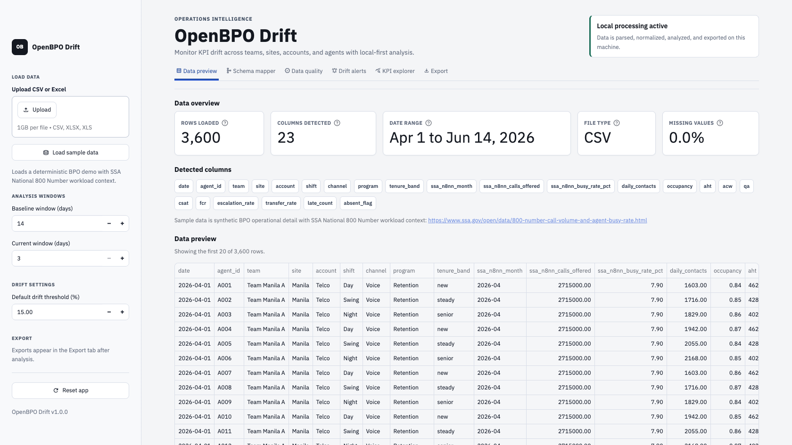
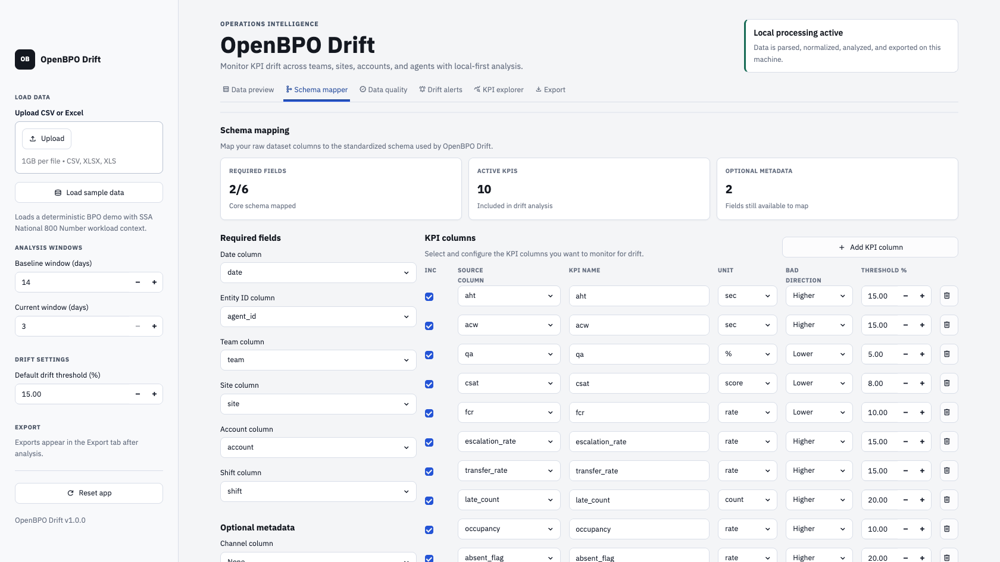
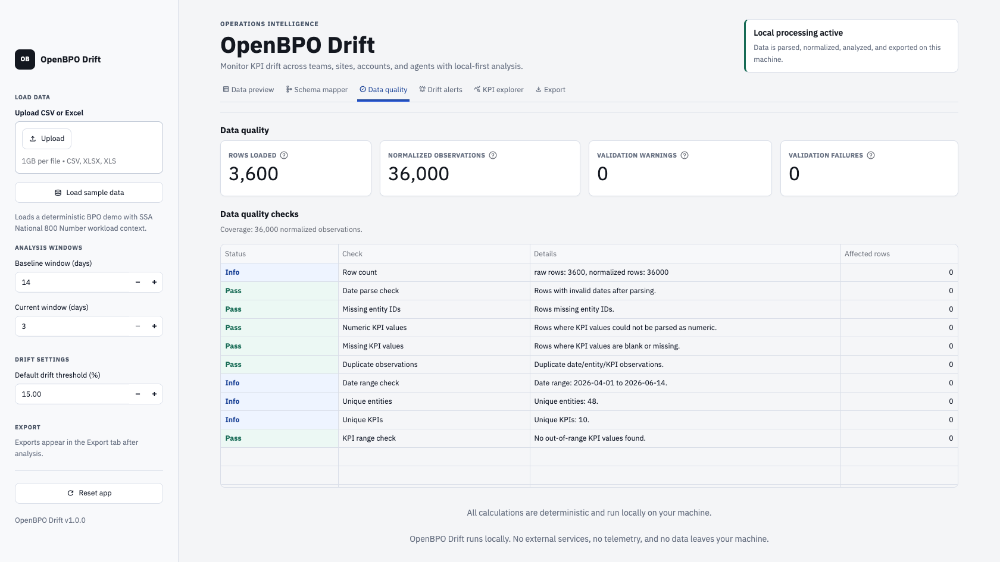
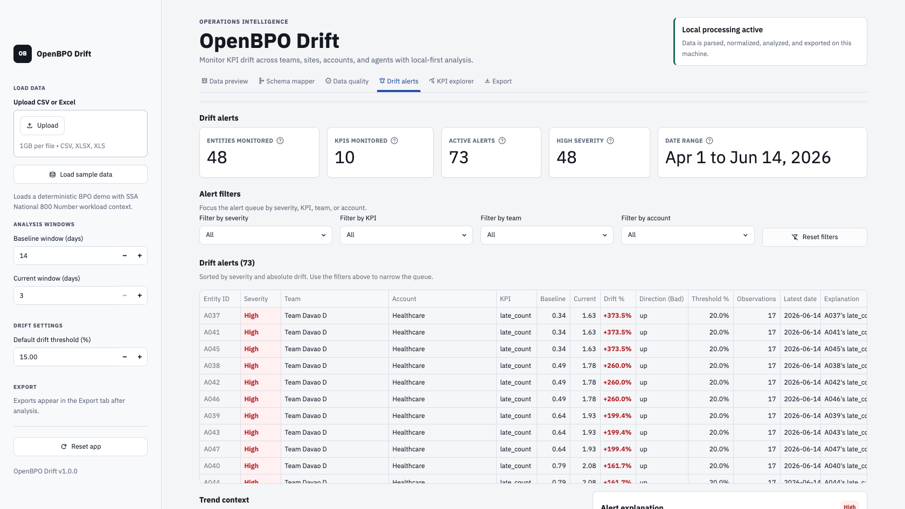
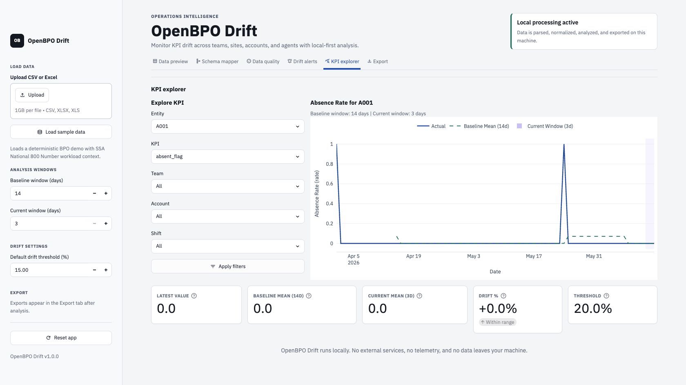
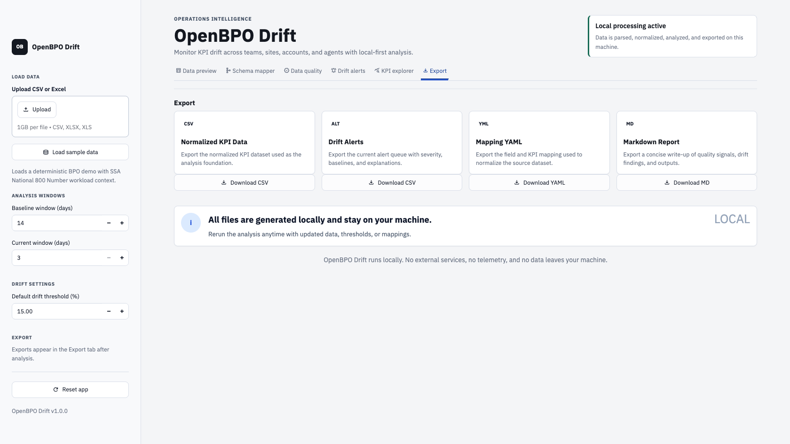

# OpenBPO Drift

OpenBPO Drift is a local-first, open-source reference app for detecting KPI drift in BPO and contact center operations. Upload CSV or Excel KPI data, map your columns, run explainable drift detection, view trend charts, and export alerts without sending data to external services.

## What v1 includes

- CSV and Excel upload
- Interactive schema mapping
- Canonical KPI normalization
- Data quality checks
- Rolling baseline drift detection
- KPI trend charts
- CSV, YAML, and Markdown export
- Deterministic demo BPO dataset with SSA National 800 Number workload context

## What v1 does not include

- LLMs
- Cloud hosting
- Authentication
- Multi-user workspaces
- Scheduled jobs
- Enterprise connectors
- Slack or email alerts

## Repository structure

```text
openbpo-drift/
├── app.py
├── LICENSE
├── README.md
├── requirements.txt
├── .streamlit/config.toml
├── configs/
│   ├── default_kpi_rules.yaml
│   └── sample_mapping.yaml
├── data/
│   └── sample_bpo_kpis.csv
├── reports/
│   └── .gitkeep
├── src/
│   ├── attribution.py
│   ├── charts.py
│   ├── config.py
│   ├── drift.py
│   ├── loaders.py
│   ├── mapper.py
│   ├── report.py
│   ├── sample_data.py
│   ├── schema.py
│   └── validation.py
└── tests/
    ├── test_drift.py
    ├── test_mapper.py
    ├── test_sample_data.py
    ├── test_report.py
    └── test_validation.py
```

## Quickstart

From the current monorepo:

```bash
git clone https://github.com/KaluArunsi/ml_projects.git
cd ml_projects/openbpo-drift
python -m venv .venv
source .venv/bin/activate
pip install -r requirements.txt
streamlit run app.py
```

Then open the local Streamlit URL shown in your terminal.

If OpenBPO Drift is later moved into a standalone repository, clone that repository directly and run the same setup commands from its root.

## Screenshots

| Data preview | Schema mapper |
| --- | --- |
|  |  |

| Data quality | Drift alerts |
| --- | --- |
|  |  |

| KPI explorer | Export |
| --- | --- |
|  |  |

## Try the sample workflow

The repository includes `data/sample_bpo_kpis.csv` and a matching YAML mapping in `configs/sample_mapping.yaml`.

The demo data is synthetic operational BPO detail. It includes aggregate context columns inspired by the public SSA National 800 Number call-volume and agent-busy-rate dataset, plus deterministic incident patterns for AHT, QA, CSAT/FCR, escalation rate, occupancy, lateness, and absence. This gives demos realistic workload context without including personal data or requiring network access.

SSA source page: https://www.ssa.gov/open/data/800-number-call-volume-and-agent-busy-rate.html

Inside the app:

1. Click `Load sample data` in the sidebar if it is not already active.
2. Review the raw file in `Data Preview`.
3. Confirm the guessed field mapping and KPI mapping in `Schema Mapper`.
4. Review normalization and data quality results.
5. Inspect drift alerts and KPI trends.
6. Export normalized data, alerts, mapping YAML, or the Markdown report.

## Regenerate sample data

```bash
python scripts/generate_sample_data.py
```

The generated file is deterministic, so tests and demos remain reproducible.

## Input format

OpenBPO Drift accepts `.csv`, `.xlsx`, and `.xls` files. V1 uses the first Excel sheet by default, with optional sheet selection in the UI.

Minimum required fields:

- `date`
- `entity_id` or equivalent mapped source column
- at least one KPI column

Optional metadata fields:

- `team`
- `site`
- `account`
- `shift`

Sample wide input:

```csv
date,agent_id,team,site,account,shift,aht,qa,csat,occupancy
2026-06-01,A001,Team Manila A,Manila,Telco,Night,420,91,4.6,0.83
```

The app normalizes this into a canonical long format with `date`, `entity_id`, `kpi_name`, `kpi_value`, and the mapped metadata fields.

## Schema mapping

The Streamlit UI keeps schema mapping in the app layer, but the reusable normalization logic lives in [src/mapper.py](src/mapper.py). `app.py` only collects mapping choices and calls into `src/`.

The mapping export format looks like this:

```yaml
field_mapping:
  date: date
  entity_id: agent_id
  team: team
  site: site
  account: account
  shift: shift

kpis:
  - source_column: aht
    kpi_name: aht
    unit: seconds
    direction_bad: up
    drift_threshold_pct: 15
    include: true
```

## Exports

The export tab provides:

- `normalized_kpis.csv`
- `drift_alerts.csv`
- `mapping.yaml`
- `openbpo_drift_report.md`

## Tests

```bash
pytest
```

The tests cover normalization, validation, drift detection, report formatting, and deterministic sample-data generation.

## Security and privacy

OpenBPO Drift is designed for local analysis. It does not send uploaded files, normalized KPI rows, alert outputs, or mapping data to external services. See [SECURITY.md](SECURITY.md) for the local-processing model, current reporting process, and v1 security limitations.

## Known limitations

OpenBPO Drift v1 is an open-source pilot/reference app, not an enterprise BPO observability platform.

- No authentication, authorization, or multi-user workspace model
- No server-side persistence beyond files you choose to export
- No scheduled jobs, background workers, or alert delivery
- No built-in data warehouse, SSO, Slack, email, or ticketing connectors
- No row-level security, audit logging, or enterprise deployment hardening
- No LLM-based analysis or hosted telemetry

## License

Copyright (C) 2026 Kalu Arunsi

SPDX-License-Identifier: AGPL-3.0-or-later

OpenBPO Drift is licensed under the GNU Affero General Public License v3.0 or later.

This means you can use, study, modify, and share the software under the terms of the AGPL. If you modify and deploy the software as a network-accessible service, the AGPL requires that you make the corresponding source code available to users of that service.

Commercial licensing is available for teams that want to embed, modify, or deploy OpenBPO Drift without AGPL obligations. Contact the maintainer for commercial licensing, private integrations, or production deployment support.

## Contributing

Contributions are welcome, but keep the v1 boundary intact. The non-negotiable rule is architectural: `app.py` stays focused on Streamlit UI, and reusable logic belongs in `src/`.
